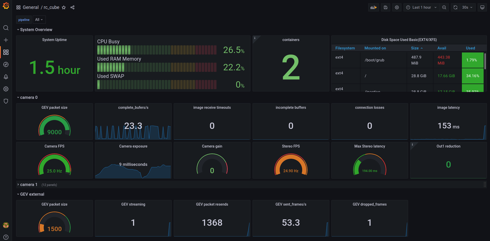

# rc_cube_monitoring

Example deployment of a docker-compose stack in [rc_cube UserSpace](https://doc.rc-cube.com/latest/en/userspace.html)
consisting of

* [Prometheus](https://prometheus.io) configured to scrape the rc_cube
  * reachable on port 9090
* [Grafana](https://grafana.com) with an example rc_cube dashboard
  * reachable on port 8080

At initial login to Grafana use user `admin`, password `admin` and set a new password.
Then go to Dashboards -> Browse and open the rc_cube dashboard.

In a real production deployment, it is highly advised to setup Grafana to use https!

